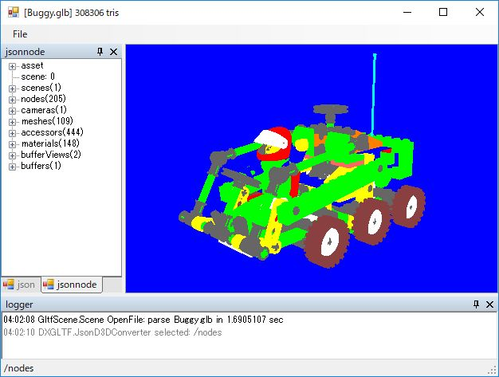

# DXGLTF

GLTF viewer using SharpDX

## Support format

* GLTF
* GLB
* VRM
* GLTF in zip
* GLB in zip
* VRM in zip

## Dock
* [ ] CameraDock
    * [ ] Auto near far
* [ ] LightDock
* [ ] HierarchyDock

## Gizmo
* [x] Axis
* [x] Grid
* [ ] BoundingBox
* [ ] Translation Gizmo
* [ ] Rotation Gizmo
* [ ] Scale Gizmo

## GLTF

### buffer
`byte[]`

### bufferView
`ArraySegments<byte>`

### accessor
`T[]`

### image
Quad

### sampler

### texture
Repeated
* [x] TextureLoad

### material
* [x] pbrMetallicRoughness.baseColorFactor
* [x] UnlitShader
* [ ] BackfaceCulling
* [ ] AlphaBlend

### mesh
3D View without transform
* [ ] BlendShape
* [ ] Primitive as submesh
* [ ] Lambert Shader

### skin

### node
* [x] ModelMatrix

### scene

## ToDo

* [x] Logger

